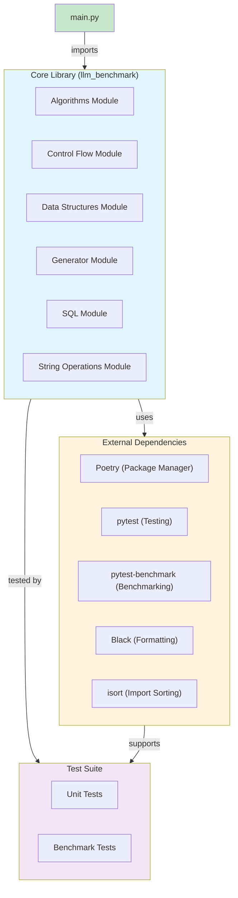
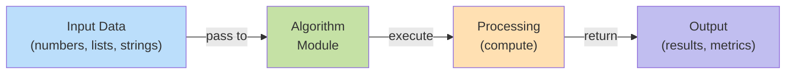
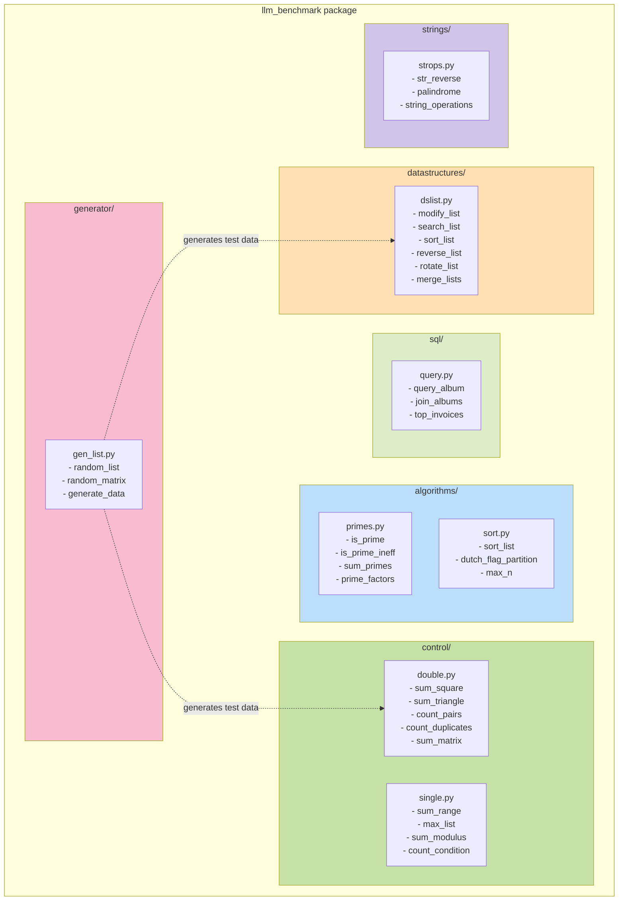
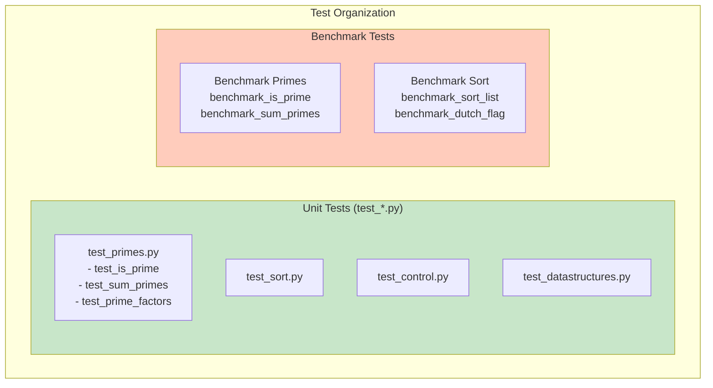
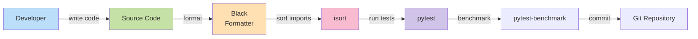
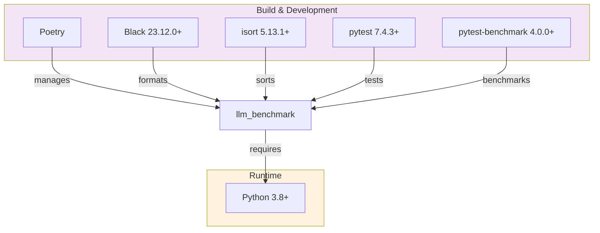

# LLM Benchmark - Architecture Documentation

## Overview

The **llm_benchmark** project is organized as a modular Python library designed to provide efficient, well-tested implementations of algorithms commonly encountered in LLM coding challenges. The architecture follows a clear separation of concerns, with each module handling a specific domain of algorithms.

## System Architecture Diagram



## Module Architecture

### High-Level Data Flow



## Detailed Module Structure



## Component Descriptions

### 1. Algorithms Module (`algorithms/`)

Implements fundamental algorithmic solutions to common coding problems.

#### Submodules

**`primes.py` - Prime Number Operations**
- **Purpose**: Handle all prime number-related computations
- **Key Functions**:
  - `is_prime(n: int) -> bool`: Efficiently checks primality using trial division up to √n
  - `is_prime_ineff(n: int) -> bool`: Optimized version (same as is_prime)
  - `sum_primes(n: int) -> int`: Computes sum of all primes < n
  - `prime_factors(n: int) -> List[int]`: Returns prime factorization
- **Time Complexity**: O(√n) for is_prime, O(n√n) for sum_primes, O(√n) for prime_factors
- **Use Cases**: Cryptography, number theory problems

**`sort.py` - Sorting Algorithms**
- **Purpose**: Provides various sorting and partitioning strategies
- **Key Functions**:
  - `sort_list(arr: List[int]) -> None`: In-place sorting (bubble sort)
  - `dutch_flag_partition(arr: List[int], pivot: int) -> None`: 3-way partition
  - `max_n(arr: List[int], n: int) -> List[int]`: Find n largest elements
- **Time Complexity**: O(n²) for sort_list, O(n) for partitioning, O(n log n) for max_n
- **Use Cases**: Data arrangement, selection problems, partitioning

### 2. Control Flow Module (`control/`)

Implements common control flow patterns used in algorithms.

#### Submodules

**`single.py` - Single Loop Patterns**
- **Purpose**: Algorithms with single iteration patterns
- **Key Functions**:
  - `sum_range(n: int) -> int`: Sum of 0 to n-1
  - `max_list(arr: List[int]) -> int`: Find maximum element
  - `sum_modulus(n: int, m: int) -> int`: Sum with modulus condition
- **Time Complexity**: All O(n)
- **Pattern**: Single pass through data

**`double.py` - Double Loop Patterns**
- **Purpose**: Algorithms with nested iteration patterns
- **Key Functions**:
  - `sum_square(n: int) -> int`: Sum of squares from 1 to n
  - `sum_triangle(n: int) -> int`: Sum of triangular numbers
  - `count_pairs(arr: List[int]) -> int`: Count element pairs
  - `count_duplicates(arr1: List[int], arr2: List[int]) -> int`: Count common elements
  - `sum_matrix(matrix: List[List[int]]) -> int`: Sum all matrix elements
- **Time Complexity**: O(n²) or O(n*m) depending on operation
- **Pattern**: Nested iteration, matrix operations

### 3. Data Structures Module (`datastructures/`)

Provides operations on fundamental data structures.

#### Submodules

**`dslist.py` - List Operations**
- **Purpose**: Common list manipulation operations
- **Key Functions**:
  - `modify_list(arr: List[int]) -> List[int]`: Transform list elements
  - `search_list(arr: List[int], target: int) -> int`: Linear search
  - `sort_list(arr: List[int]) -> List[int]`: Sort list (non-mutating)
  - `reverse_list(arr: List[int]) -> List[int]`: Reverse order
  - `rotate_list(arr: List[int], k: int) -> List[int]`: Rotate by k positions
  - `merge_lists(arr1: List[int], arr2: List[int]) -> List[int]`: Combine lists
- **Time Complexity**: O(n) for most operations
- **Use Cases**: Array manipulation, list processing

### 4. Generator Module (`generator/`)

Utility functions for creating test data.

#### Submodules

**`gen_list.py` - Data Generation**
- **Purpose**: Generate random data for testing
- **Key Functions**:
  - `random_list(size: int, max_val: int) -> List[int]`: Generate random list
  - `random_matrix(rows: int, cols: int) -> List[List[int]]`: Generate random matrix
- **Use Cases**: Test data creation, benchmark setup

### 5. SQL Module (`sql/`)

Provides examples of SQL query operations.

#### Submodules

**`query.py` - Database Queries**
- **Purpose**: Demonstrate SQL operations and data joining
- **Key Functions**:
  - `query_album(name: str) -> dict`: Query album by name
  - `join_albums() -> List[dict]`: Join multiple datasets
  - `top_invoices() -> List[dict]`: Get top invoices
- **Use Cases**: Database operations, data aggregation

### 6. String Operations Module (`strings/`)

Implements string manipulation algorithms.

#### Submodules

**`strops.py` - String Operations**
- **Purpose**: Handle string transformations and checks
- **Key Functions**:
  - `str_reverse(s: str) -> str`: Reverse a string
  - `palindrome(s: str) -> bool`: Check if string is palindrome
- **Time Complexity**: O(n) for both operations
- **Use Cases**: String processing, pattern matching

## Test Architecture



### Test Structure

Tests follow the same module structure as the source code:

```
tests/
└── llm_benchmark/
    ├── algorithms/
    │   ├── test_primes.py
    │   └── test_sort.py
    ├── control/
    │   └── test_*.py
    ├── datastructures/
    │   └── test_*.py
    └── ...
```

### Test Types

1. **Unit Tests**: Verify individual function correctness
   - Use `@pytest.mark.parametrize` for multiple test cases
   - Include edge cases and boundary conditions
   - All tests run with `pytest --benchmark-skip tests/`

2. **Benchmark Tests**: Measure performance
   - Use `benchmark` fixture from pytest-benchmark
   - Run with `pytest --benchmark-only tests/`
   - Results stored in `.benchmarks/` directory

## Development Workflow Architecture



## Dependencies and External Systems

### Direct Dependencies



## Design Patterns

### 1. Static Method Pattern
All algorithm classes use `@staticmethod` for stateless operations:
```python
class Primes:
    @staticmethod
    def is_prime(n: int) -> bool:
        ...
```

### 2. Type Hints
All functions include type annotations:
```python
def process_data(arr: List[int]) -> int:
    ...
```

### 3. Parametrized Testing
Tests use `@pytest.mark.parametrize` for multiple cases:
```python
@pytest.mark.parametrize("n, expected", [(2, True), (4, False)])
def test_is_prime(n, expected):
    assert Primes.is_prime(n) == expected
```

## Performance Characteristics

| Module | Algorithm | Time | Space | Notes |
|--------|-----------|------|-------|-------|
| Algorithms | is_prime | O(√n) | O(1) | Trial division |
| Algorithms | sum_primes | O(n√n) | O(1) | Iterates all numbers |
| Algorithms | prime_factors | O(√n) | O(log n) | Returns list of factors |
| Control | sum_range | O(n) | O(1) | Linear iteration |
| Control | sum_square | O(n) | O(1) | Mathematical formula possible |
| Control | count_pairs | O(n²) | O(1) | Nested iteration |
| DataStructures | sort_list | O(n²) | O(1) | In-place bubble sort |
| DataStructures | rotate_list | O(n) | O(n) | Creates new list |
| Strings | str_reverse | O(n) | O(n) | Creates new string |

## Extension Points

### Adding a New Algorithm Module

1. Create module directory: `src/llm_benchmark/new_module/`
2. Implement algorithms with type hints and docstrings
3. Create test file: `tests/llm_benchmark/new_module/test_*.py`
4. Update `main.py` to include demonstration
5. Update `README.md` with usage examples
6. Run tests and benchmarks
7. Format code with Black and isort

### Adding Tests for Existing Module

1. Create test file in corresponding test directory
2. Write unit tests with `@pytest.mark.parametrize`
3. Add benchmark tests for performance-critical functions
4. Run tests: `poetry run pytest tests/ -v`
5. Verify coverage

## Build and Deployment

### Build Process
1. Dependencies installed via Poetry
2. Source code formatted with Black and isort
3. Tests run with pytest
4. Benchmarks collected with pytest-benchmark

### Directory Layout
```
.
├── src/llm_benchmark/       # Source code
├── tests/                   # Test files
├── artemis_scripts/         # Build/test automation
├── data/                    # Data files (SQL databases)
├── pyproject.toml          # Project configuration
└── README.md               # Documentation
```

## Summary

The architecture of **llm_benchmark** is designed to be:
- **Modular**: Clear separation by algorithm category
- **Testable**: Comprehensive unit and benchmark tests
- **Maintainable**: Type hints, docstrings, and code formatting
- **Efficient**: Optimized algorithms with performance metrics
- **Extensible**: Easy to add new algorithms and modules

The project serves as both a learning resource and a benchmarking tool for common coding patterns.
