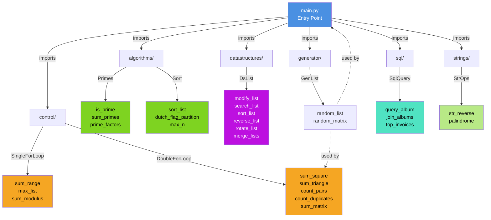

# LLM Benchmark

A comprehensive collection of Python functions designed to benchmark and test algorithms across multiple domains. This project includes implementations of common algorithms for learning, performance analysis, and optimization demonstrations.

## Purpose

This project serves as a benchmark suite for evaluating algorithmic implementations across various categories:

- **Algorithms**: Prime number operations, sorting techniques
- **Control Flow**: Single and double loop patterns
- **Data Structures**: List operations and manipulations
- **Generators**: Utility functions for generating test data
- **SQL**: Database query operations
- **String Operations**: String manipulation and analysis

The project is particularly useful for:
- Learning fundamental algorithms and data structures
- Benchmarking algorithm performance
- Understanding optimization techniques
- Testing LLM-generated code quality

## Architecture

The project is organized into modular packages, each focusing on specific problem domains:

```
src/llm_benchmark/
├── algorithms/        # Prime numbers, sorting
├── control/          # Single and double loop patterns
├── datastructures/   # List operations
├── generator/        # Test data generation
├── sql/              # Database queries
└── strings/          # String operations
```

For a detailed architecture diagram, see [Architecture Diagram](#architecture-diagram).

## Setup

### Prerequisites

- Python 3.8 or higher
- Poetry (for dependency management)

### Installation

1. **Clone the repository**
   ```bash
   git clone <repository-url>
   cd llm_benchmark
   ```

2. **Install dependencies using Poetry**
   ```bash
   poetry install
   ```

   This will create a virtual environment and install all required packages.

3. **Verify the installation**
   ```bash
   poetry run python main.py
   ```

## Usage

### Running the Demonstration

To see all modules in action, run the main demonstration:

```bash
poetry run main
```

This executes all benchmark demonstrations including:
- Single loop operations (sum_range, max_list, sum_modulus)
- Double loop operations (sum_square, sum_triangle, count_pairs, count_duplicates, sum_matrix)
- SQL queries (album queries, joins, invoices)
- Prime number operations (is_prime, sum_primes, prime_factors)
- Sorting operations (sort_list, dutch_flag_partition, max_n)
- Data structure operations (modify, search, sort, reverse, rotate, merge)
- String operations (reverse, palindrome check)

### Using Modules Directly

Import and use specific modules in your Python code:

```python
from llm_benchmark.algorithms.primes import Primes
from llm_benchmark.control.single import SingleForLoop
from llm_benchmark.control.double import DoubleForLoop
from llm_benchmark.algorithms.sort import Sort
from llm_benchmark.generator.gen_list import GenList
from llm_benchmark.datastructures.dslist import DsList
from llm_benchmark.strings.strops import StrOps
from llm_benchmark.sql.query import SqlQuery

# Examples
print(Primes.is_prime(17))  # True
print(SingleForLoop.sum_range(10))  # 45
print(Sort.sort_list([5, 3, 1]))  # Sorts in-place
```

### Running Tests

Execute the test suite using pytest:

```bash
poetry run pytest
```

Run tests with verbose output:

```bash
poetry run pytest -v
```

Run benchmarks:

```bash
poetry run pytest --benchmark-only
```

## Build & Run Instructions

### Development Setup

1. Install development dependencies (includes linting and formatting tools):
   ```bash
   poetry install
   ```

2. Format code with Black:
   ```bash
   poetry run black src/ tests/ main.py
   ```

3. Sort imports with isort:
   ```bash
   poetry run isort src/ tests/ main.py
   ```

4. Run tests:
   ```bash
   poetry run pytest
   ```

### Building a Distribution

To build the package for distribution:

```bash
poetry build
```

This generates both source and wheel distributions in the `dist/` directory.

### Installing from Source

To install the package in development mode (editable):

```bash
poetry install
```

To use the `main` command after installation:

```bash
poetry run main
```

### Project Entry Point

The project defines a `main` script in `pyproject.toml`:

```toml
[tool.poetry.scripts]
main = "main:main"
```

This allows running the main demonstration via:
```bash
poetry run main
```

## Module Overview

### Algorithms (`algorithms/`)

**Primes** - Prime number operations
- `is_prime(n)` - Check if a number is prime (optimized O(√n))
- `is_prime_ineff(n)` - Alternative prime check implementation
- `sum_primes(n)` - Sum all primes up to n
- `prime_factors(n)` - Find all prime factors of a number

**Sort** - Sorting and selection algorithms
- `sort_list(v)` - Sort a list in-place
- `dutch_flag_partition(v, pivot)` - Partition array around pivot
- `max_n(v, n)` - Find n largest elements

### Control Flow (`control/`)

**SingleForLoop** - Single loop patterns
- `sum_range(n)` - Sum integers from 0 to n
- `max_list(v)` - Find maximum value in list
- `sum_modulus(n, m)` - Sum values divisible by m

**DoubleForLoop** - Double loop patterns
- `sum_square(n)` - Sum of squares from 0 to n
- `sum_triangle(n)` - Triangular sum
- `count_pairs(arr)` - Count matching pairs
- `count_duplicates(arr0, arr1)` - Count matching positions
- `sum_matrix(matrix)` - Sum all elements in matrix

### Data Structures (`datastructures/`)

**DsList** - List operations
- `modify_list(lst)` - Transform list elements
- `search_list(lst, target)` - Find element in list
- `sort_list(lst)` - Sort a list
- `reverse_list(lst)` - Reverse a list
- `rotate_list(lst, k)` - Rotate list by k positions
- `merge_lists(lst1, lst2)` - Merge two lists

### Generator (`generator/`)

**GenList** - Test data generation
- `random_list(n, m)` - Generate n random integers (0 to m-1)
- `random_matrix(n, m)` - Generate n×m random matrix

### SQL (`sql/`)

**SqlQuery** - Database query operations
- `query_album(name)` - Query album by name
- `join_albums()` - Join multiple album tables
- `top_invoices()` - Get top invoices

### Strings (`strings/`)

**StrOps** - String operations
- `str_reverse(s)` - Reverse a string
- `palindrome(s)` - Check if string is palindrome

## Architecture Diagram



## Contributing

Please see [CONTRIBUTING.md](CONTRIBUTING.md) for guidelines on how to contribute to this project.

## Development

### Code Style

The project uses:
- **Black** - Code formatting
- **isort** - Import sorting

Run these tools before committing:

```bash
poetry run black src/ tests/ main.py
poetry run isort src/ tests/ main.py
```

### Testing

The project uses pytest with benchmark support. Add tests in the `tests/` directory following the existing structure.

```bash
poetry run pytest -v
```

## License

[Add your license information here]

## Version

Version: 0.1.0

Authors: Matthew Truscott (matthew.truscott@turintech.ai)
